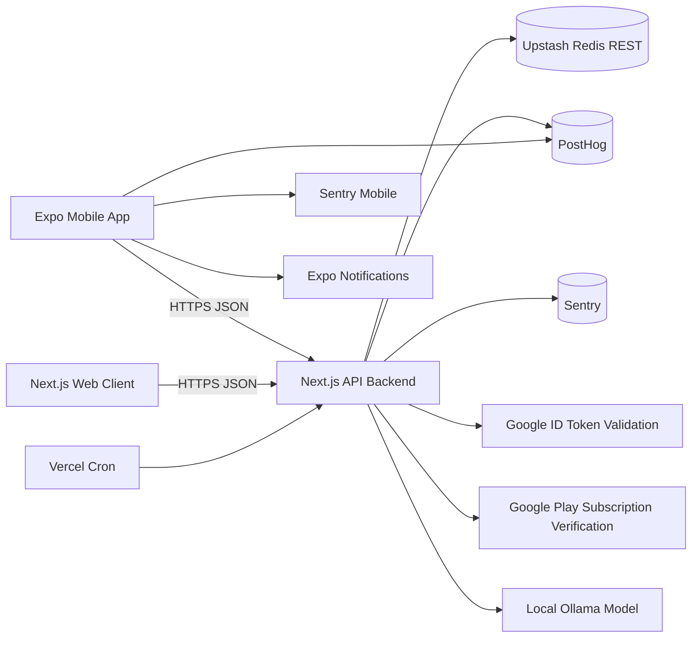

# TriggerMap Technical Specification

## 1. Document Purpose

This document defines the current-state technical architecture for TriggerMap and establishes the implementation contract for the mobile app, backend API, web client, shared package, analytics, reporting pipeline, and operational model.

It is intended for:

- Engineers onboarding into the codebase
- Product and design stakeholders who need implementation-aware constraints
- QA and release owners validating end-to-end behavior
- Future contributors extending reporting, subscriptions, notifications, or web support

## 2. Product Summary

TriggerMap is a lightweight emotional pattern tracking product built around fast event capture. A user logs a trigger, selects an emotion, optionally adds context, and receives:

- a searchable chronological timeline of moments
- lightweight immediate feedback after repeated trigger-emotion patterns
- a weekly report that aggregates the last seven days of activity
- optional authenticated continuity across devices and sessions
- premium subscription hooks for deeper paid experiences

The current implementation prioritizes low-friction logging, anonymous-first use, and Redis-backed aggregation that can support both real-time and scheduled reporting.

## 3. System Scope

### In Scope

- Expo/React Native mobile application
- Next.js backend used primarily as an API service
- Lightweight Next.js web client / PWA for anonymous access
- Shared constants and shape definitions used across packages
- Upstash Redis persistence and derived aggregate storage
- Email/password login and Google ID token login
- JWT-backed session validation
- Weekly report generation and optional local AI summary generation
- Android subscription verification through Google Play Developer API
- PostHog analytics and Sentry crash/error monitoring

### Out of Scope

- Multi-user collaboration
- clinician workflows or provider dashboards
- iOS subscription purchasing flows
- admin tooling
- historical analytics beyond the rolling windows already modeled in Redis
- personalization beyond current rule-based and batch AI insight generation

## 4. Monorepo Structure

| Workspace | Responsibility | Runtime |
| --- | --- | --- |
| `mobile/` | Primary end-user app | Expo / React Native |
| `backend/` | API routes, auth, storage, reporting, legal pages | Next.js on Node/Vercel |
| `web/` | Lightweight browser PWA for anonymous capture and reading | Next.js |
| `shared/` | Shared constants and typedefs | Local package |
| `docs/` | Product, compliance, and engineering documentation | Static markdown |

## 5. Architectural Principles

1. Anonymous-first logging
   Users can create meaningful data before authentication. Authentication upgrades continuity instead of blocking first use.
2. Derived-data over expensive queries
   The system writes aggregate counters as moments are created, reducing report generation cost.
3. Shared domain vocabulary
   Trigger and emotion labels are centralized in `shared/` to avoid drift between mobile, backend, and web.
4. Minimal backend surface area
   Most backend logic is exposed as a small set of API endpoints backed by composable services.
5. Operational simplicity
   Redis over REST, cron-based weekly generation, and Vercel deployment reduce infrastructure overhead.

## 6. High-Level Architecture



## 7. Runtime Components

### 7.1 Mobile App

The mobile app is the primary client. It uses Expo Router for navigation, a `SessionProvider` for application state, SecureStore/AsyncStorage for device persistence, and a small service layer for API, analytics, crash reporting, notifications, and subscriptions.

Primary responsibilities:

- bootstrap device identity and stored session
- handle onboarding and authentication
- capture trigger/emotion moments
- display timeline and weekly report
- manage reminders, export, and premium access

### 7.2 Backend API

The backend is a Next.js Pages Router application used as a JSON API. Each route is thin and delegates logic into `services/`. Redis is the source of truth for sessions, moments, aggregate counters, subscription state, and stored weekly AI insight payloads.

Primary responsibilities:

- validate input and rate limits
- authenticate signed JWT sessions
- persist moments and aggregates
- compute timeline and weekly reports
- verify subscriptions
- emit analytics and monitoring events

### 7.3 Web Client

The web client is a lean anonymous-first PWA surface that supports:

- moment logging
- timeline browsing
- weekly report browsing
- installable PWA behavior

It mirrors the core backend API contract and creates its own browser-local `deviceId`.

### 7.4 Shared Package

The shared package contains the canonical trigger set, emotion set, notification labels, and JSDoc typedefs used as the system’s lightweight schema contract.

## 8. Technology Stack

| Area | Technology |
| --- | --- |
| Mobile UI | Expo, React Native, Expo Router |
| Mobile storage | AsyncStorage, SecureStore |
| Backend | Next.js Pages API, Node.js |
| Web | Next.js |
| Shared code | Local workspace package |
| Persistence | Upstash Redis via REST |
| Auth | Email/password, Google ID tokens, JWT via `jose` |
| Validation | `zod` |
| Analytics | PostHog |
| Monitoring | Sentry |
| Charts | `react-native-chart-kit` |
| Payments | `react-native-iap`, Google Play Android Publisher API |
| AI insight generation | Ollama-compatible local model |
| Deployment | Vercel for backend, EAS for Android builds |

## 9. Data Model

### 9.1 Core Entity: TriggerMoment

```js
{
  id: string,
  ownerId: string,
  trigger: string,
  emotion: string,
  note: string,
  timestamp: string,
  isAnonymous: boolean
}
```

### 9.2 Weekly Aggregate Snapshot

Daily aggregate hashes store a denormalized snapshot keyed by owner and day:

- total count
- trigger counts
- emotion counts
- trigger-emotion pair counts
- time-of-day bucket counts

### 9.3 Weekly Insight Report

The weekly report is derived from the last seven aggregate snapshots and includes:

- top trigger
- top emotion
- top pair
- correlation map
- time-of-day activity distribution
- energy distribution
- weekly emotion trajectory
- volatility score and narrative label
- most stable day
- optional AI summary payload
- generated insight strings

### 9.4 User and Session Data

User records store:

- id
- email
- name
- provider
- createdAt
- password hash if email-authenticated
- googleSub if Google-authenticated

Session records store:

- sessionId
- userId
- createdAt
- expiresAt

### 9.5 Subscription Data

Subscription hashes store:

- status
- subscriptionId
- purchaseToken
- expiresAt
- updatedAt
- optional `stubbed` flag in non-configured environments

## 10. Redis Key Design

All keys are prefixed with `triggermap:`.

| Key Pattern | Purpose |
| --- | --- |
| `triggermap:user:{userId}` | User hash |
| `triggermap:userEmail:{email}` | Email to user lookup |
| `triggermap:userGoogle:{googleSub}` | Google subject lookup |
| `triggermap:session:{sessionId}` | Session hash |
| `triggermap:moments:{ownerId}` | Ordered list of raw moments |
| `triggermap:daily:{ownerId}:{yyyy-mm-dd}` | Daily aggregate hash |
| `triggermap:owners` | Set of owners with aggregate activity |
| `triggermap:weekly_report:{ownerId}` | Stored AI weekly insight payload |
| `triggermap:subscription:{userId}` | Subscription hash |
| `triggermap:ratelimit:{key}` | Request throttling buckets |
| `triggermap:dau:{yyyy-mm-dd}` | Daily active owner set |
| `triggermap:counter:{name}` | Simple numeric counters |
| `triggermap:health` | Healthcheck probe key |

## 11. Client Identity Model

### 11.1 Anonymous Identity

Anonymous usage is keyed by a persistent device identifier:

- mobile creates and persists a UUID using AsyncStorage + SecureStore
- web creates and persists a browser-local ID in localStorage

This allows logging, timeline access, export, and weekly report access without authentication.

### 11.2 Authenticated Identity

After login or registration, the backend creates a JWT session and migrates any moments from the anonymous `deviceId` owner to the authenticated `user.id` owner.

This preserves continuity while keeping the initial capture flow low-friction.

## 12. Authentication and Authorization

### 12.1 Supported Auth Methods

- Email/password registration and login
- Google login using a mobile Google ID token

### 12.2 Session Mechanics

- backend signs JWTs with `HS256`
- token subject is the `user.id`
- token includes `sid` for session lookup
- session hashes in Redis enforce server-side existence and expiry
- session lifetime is 30 days

### 12.3 Authenticated vs Anonymous Access

Authenticated endpoints:

- `GET /api/me`
- `POST /api/subscription/verify`

Dual-mode endpoints that accept either session token or `deviceId`:

- `POST /api/logMoment`
- `GET /api/timeline`
- `GET /api/weeklyReport`
- `GET /api/export`

## 13. API Surface

### 13.1 `POST /api/register`

Creates an email-auth user, issues a session, migrates anonymous moments, and tracks registration analytics.

Input:

```json
{
  "email": "user@example.com",
  "password": "min-8-chars",
  "name": "User Name",
  "deviceId": "optional-anonymous-device-id"
}
```

Success:

```json
{
  "ok": true,
  "data": {
    "token": "jwt",
    "user": {},
    "migratedMoments": 4
  }
}
```

### 13.2 `POST /api/login`

Authenticates an email/password user or Google user, creates a session, migrates anonymous moments, and returns the session payload.

### 13.3 `GET /api/me`

Validates session and returns user + subscription state.

### 13.4 `POST /api/logMoment`

Logs a moment for an authenticated user or anonymous device owner.

Validates:

- emotion required
- trigger optional but normalized
- note max 280 characters
- rate limit: 120 requests per 60 seconds per client IP

Persists:

- raw moment list item
- counter increment
- daily aggregate update
- DAU touch
- analytics event

Returns:

- stored moment
- optional pattern feedback
- optional smart reflection prompt
- pair count

### 13.5 `GET /api/timeline`

Returns reverse-chronological moments plus a grouped-by-day representation.

### 13.6 `GET /api/weeklyReport`

Modes:

- default: compute and return a report for the active owner
- `?mode=scheduled`: trigger the weekly batch generation loop for all known owners

### 13.7 `GET /api/export`

Returns a downloadable JSON document containing all moments for the active owner.

### 13.8 `POST /api/subscription/verify`

Validates an authenticated subscription purchase token and stores the resulting entitlement state.

### 13.9 `GET /api/health`

Performs a backend readiness check by validating Redis round-trip and reporting environment readiness booleans.

## 14. Input Normalization and Data Hygiene

- free-text notes are sanitized to remove control characters, collapse whitespace, trim, and cap at 280 characters
- invalid trigger values fall back to keyword detection from note text, otherwise `alone`
- invalid emotion values fall back to `neutral`
- timestamps are normalized to ISO format
- owner identity is enforced as either `user.id` or `deviceId`

## 15. Reporting and Pattern Engine

### 15.1 Real-Time Aggregate Maintenance

On every moment write, the system updates a day-specific aggregate hash. This avoids recomputing reports by scanning all raw moments for each report request.

Updated dimensions:

- total moments
- per-trigger frequency
- per-emotion frequency
- trigger-emotion pair frequency
- time-of-day bucket frequency

### 15.2 Weekly Report Computation

The report engine consumes the last seven daily aggregate snapshots and computes:

- top trigger and top emotion
- strongest trigger-emotion correlation
- time-of-day with highest activity
- emotion-energy distribution
- daily average emotion score trajectory
- variance-derived volatility score
- narrative volatility summary
- most stable day
- human-readable insight list

### 15.3 AI Summary Layer

The scheduled report job optionally asks a local Ollama model for:

- a concise summary
- a possible explanation
- a simple suggestion

The resulting payload is cached in Redis and merged into the read-time weekly report response.

### 15.4 Immediate Feedback Layer

After a moment is saved, the backend checks the seven-day count for the trigger-emotion pair. Based on thresholds, it returns:

- `patternFeedback` when a repeated pattern is detected
- `smartReflectionPrompt` for either rule-based exercise/calm insight or higher pair frequency follow-up reflection

## 16. Subscription System

### 16.1 Mobile Purchase Flow

1. User opens Premium tab.
2. User taps Start subscription.
3. App initializes the Play billing connection.
4. App requests the monthly subscription SKU.
5. App extracts the purchase token.
6. App sends token and subscription ID to backend verification endpoint.
7. Backend validates via Google Play or uses a stubbed fallback if environment variables are absent.
8. App finishes the transaction and stores the returned subscription state in session memory.

### 16.2 Environment Fallback Behavior

If Google Play credentials are not configured, the backend stores a stubbed `grace_period` subscription for 30 days. This supports non-production testing while making the environment difference explicit.

## 17. Notifications

Supported notification types:

- Reflection reminder
- Pattern alert
- Weekly insight ready

Guardrails before sending notifications:

- user must grant notification permission
- only one notification per day
- no reminder if a moment was already logged that day
- no reminder if the app was opened recently within a 45-minute window

Triggering behavior:

- after logging a moment, a pattern alert may be scheduled immediately
- if reminders are enabled, a daily reflection reminder is scheduled
- enabling weekly reminder schedules a weekly Monday 7 PM local notification

## 18. Analytics and Monitoring

### 18.1 Analytics Events

Mobile and backend both emit analytics. Current important events include:

- `login_completed`
- `register_completed`
- `moment_logged`
- `weekly_report_viewed`
- `subscription_started`
- `subscription_cancelled`

### 18.2 Monitoring

- mobile initializes Sentry at app boot
- backend captures route failures through a monitoring wrapper
- backend health endpoint validates Redis availability and key environment readiness

## 19. Security Model

### 19.1 Current Protections

- bcrypt password hashing with cost 12
- JWT signing via server secret
- server-side session existence checks
- zod input validation at API boundary
- authorization header parsing only when prefixed with Bearer
- request rate limiting by client IP for auth and logging routes
- text sanitization for notes and names

### 19.2 Current Risks and Constraints

- anonymous owners are device-scoped rather than user-verified
- no refresh token rotation; long-lived session token is used directly
- per-IP rate limiting is coarse and may not handle shared-network edge cases well
- Redis REST access requires careful environment management because it is directly used for all persistence
- AI summary generation depends on a locally reachable Ollama service, which is not a managed production dependency by default

## 20. Deployment and Operations

### 20.1 Backend Deployment

- hosted on Vercel
- API functions under `pages/api/**/*.js`
- current function max duration: 10 seconds
- scheduled cron triggers `GET /api/weeklyReport?mode=scheduled` every Monday at 03:00 UTC

### 20.2 Mobile Deployment

- built with EAS for Android AAB release
- requires Expo env configuration and store credentials outside the repo

### 20.3 Web Deployment

- standard Next.js deployment
- designed as a lightweight companion surface rather than the primary product experience

## 21. Environment Requirements

### 21.1 Backend Required Variables

- `UPSTASH_REDIS_REST_URL`
- `UPSTASH_REDIS_REST_TOKEN`
- `JWT_SECRET`
- `APP_BASE_URL`

### 21.2 Backend Optional / Feature Variables

- `GOOGLE_CLIENT_ID`
- `POSTHOG_KEY`
- `POSTHOG_HOST`
- `SENTRY_DSN`
- `GOOGLE_PLAY_SERVICE_ACCOUNT_JSON`
- `GOOGLE_PLAY_PACKAGE_NAME`
- `MODEL_PROVIDER`
- `MODEL_NAME`

### 21.3 Mobile Public Variables

- `EXPO_PUBLIC_API_URL`
- `EXPO_PUBLIC_WEB_BASE_URL`
- `EXPO_PUBLIC_POSTHOG_KEY`
- `EXPO_PUBLIC_POSTHOG_HOST`
- `EXPO_PUBLIC_GOOGLE_CLIENT_ID`
- `EXPO_PUBLIC_GOOGLE_ANDROID_CLIENT_ID`
- `EXPO_PUBLIC_GOOGLE_EXPO_CLIENT_ID`

### 21.4 Web Variables

- `NEXT_PUBLIC_API_URL`

## 22. Performance Characteristics

### 22.1 Fast Paths

- timeline reads scan only one owner’s raw moment list
- weekly reports read seven aggregate hashes instead of full raw history
- immediate feedback checks only seven daily aggregate snapshots

### 22.2 Potential Bottlenecks

- very large raw moment lists per owner may slow export and timeline operations over time
- batch weekly report generation loops serially through all owners
- Redis REST round-trips add latency compared to direct Redis connections
- local-model AI generation is likely the slowest scheduled-path dependency

## 23. Failure Modes and User Impact

| Failure | User Impact | Current Behavior |
| --- | --- | --- |
| Backend unavailable | Mobile startup and data fetches fail | Startup toast, retry-capable screens |
| Redis unavailable | Most backend operations fail | Healthcheck fails, API returns server errors |
| Session invalid | Authenticated actions fail | Session bootstrap clears token on failure |
| Google auth not configured | Google login unavailable | Dedicated server error response |
| Play verification not configured | Subscription is stubbed | Grace-period state returned |
| Ollama unavailable | No fresh AI summaries in scheduled path | Weekly report still computes without generated summary |

## 24. Engineering Constraints

- Backend uses the Pages Router, not App Router handlers.
- Shared package is JavaScript-first and relies on JSDoc typing rather than full TypeScript enforcement.
- Anonymous and authenticated ownership models coexist and must be supported in API contracts.
- Reporting logic depends on daily aggregates being written at log time; backfills require aggregate regeneration if raw data changes retroactively.
- Premium copy currently promises features that are only partially implemented in code and should be aligned before broad release.

## 25. Recommended Next Technical Evolutions

1. Introduce a formal schema package with runtime and static typing for all API payloads.
2. Add aggregate backfill and repair scripts for data correction scenarios.
3. Move weekly generation to concurrent batch processing if owner volume increases.
4. Add session revocation and token refresh strategy.
5. Gate premium features in both UI and backend instead of only storing subscription state.
6. Add integration tests for anonymous-to-auth migration, report generation, and subscription verification fallback behavior.

## 26. Source of Truth Files

The most important implementation references for this spec are:

- `mobile/hooks/useAppSession.js`
- `mobile/services/api.js`
- `mobile/services/deviceService.js`
- `mobile/services/notificationService.js`
- `backend/pages/api/*.js`
- `backend/services/authService.js`
- `backend/services/momentService.js`
- `backend/services/aggregationService.js`
- `backend/services/patternEngine.js`
- `backend/jobs/generateWeeklyReports.js`
- `backend/services/subscriptionService.js`
- `shared/constants/*.js`

## 27. Acceptance Criteria for Major System Behavior

### Logging

- A user can log a moment anonymously.
- Invalid trigger input still results in a stored normalized trigger.
- Immediate feedback returns when pair frequency crosses the implemented threshold.

### Auth

- A user can register or login and receive a session token.
- Anonymous moments tied to `deviceId` migrate to the authenticated owner.

### Reporting

- A weekly report can be generated from the most recent seven aggregate snapshots.
- The report returns a usable empty-state structure when data is sparse.

### Subscriptions

- A signed-in user can initiate a subscription flow.
- The backend stores a verifiable subscription state or a clearly stubbed fallback.

### Notifications

- Weekly reminders can be enabled and disabled.
- The app suppresses notification spam through one-per-day and recent-open checks.

## 28. Document Status

Status: current-state technical specification based on repository implementation as of March 13, 2026.
